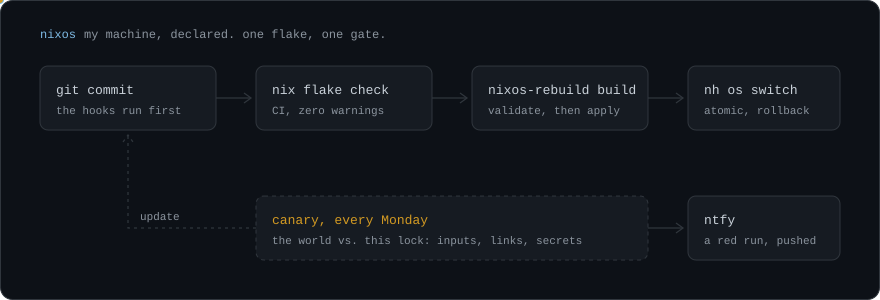
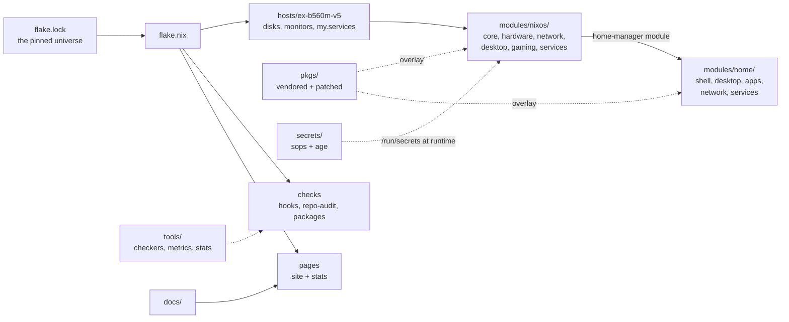

<!-- markdownlint-disable-next-line MD041 -->


<p>
  <a href="https://github.com/v1cferr/dotfiles/actions/workflows/nix.yml"></a>
  <a href="https://github.com/v1cferr/dotfiles/actions/workflows/canary.yml"></a>
  <a href="https://scorecard.dev/viewer/?uri=github.com/v1cferr/dotfiles"></a>
  <a href="https://www.bestpractices.dev/projects/15115"></a>
  <br>
  
  
  <a href="docs/rules.md"></a>
  
  <a href="https://dotfiles.v1cferr.dev/"></a>
  
  <a href="#license"></a>
</p>

```nix
{ ... }:

{
  dotfiles = {
    what    = "my whole machine, declared: NixOS + home-manager in one flake";
    host    = "ex-b560m-v5";
    base    = "nixos-26.05";       # plus `pkgs.unstable.*`, per package
    rebuild = "one command applies the system AND my user";
    until   = 2032;                # the design goal, not a guess
  };

  quality = {
    gate       = "nix flake check";  # one definition: at the commit, locally and in the CI
    warnings   = 0;                  # an evaluation warning fails like an error (rule 21)
    canary     = "every Monday";     # the world vs. this lock, before an `update` finds out
    exceptions = "a reason AND a review date";  # rule 22
  };

  hardware = {
    cpu  = "Intel i5-11400";
    gpu  = "Intel Arc B580";                    # open xe driver, Mesa, no CUDA
    disk = "Kingston KC3000, btrfs subvolumes";
    boot = "GRUB, dualboot with Windows 11, Secure Boot with my own keys";
  };

  desktop = [ "Hyprland (Lua config)" "Quickshell bar" "PipeWire" "TokyoNight, one palette" ];

  meta.docs = "https://dotfiles.v1cferr.dev";  # the WHY of every module lives there
}
```

<a href="https://dotfiles.v1cferr.dev/stats/stats.json"></a>

The numbers above are counted from the source of the commit that published them, at BUILD,
by [`tools/repo-stats`](tools/repo-stats/package.nix): the same commit always shows the same
stats, no bot commits to keep them fresh, and nothing drawn by a third party. How, and why:
[notes/repo/readme.md](docs/notes/repo/readme.md).

## Day-to-day use

Defined in [`modules/home/shell/zsh.nix`](modules/home/shell/zsh.nix):

```bash
rebuild   # nh os switch <flake> && hyprctl reload
update    # every vendored bump + nix flake update + vscode-extensions-dump
upgrade   # update && rebuild, the equivalent of `apt update && apt full-upgrade`
gc        # sudo nix-collect-garbage -d, drops old generations (no rollback after it)
```

`update` does more than bump `flake.lock`: `vendored-bump` runs the bump of every vendored binary
(VS Code, CurseForge, codex and the Antigravity CLI) and the VS Code extension mirror is
regenerated. It runs as my user and not root, because that is who holds the SSH key for the
private inputs.

With no `#host`, `nixos-rebuild` matches the current `hostname` against `nixosConfigurations`. For
a specific host: `sudo nixos-rebuild switch --flake .#<host>`.

## Architecture

One flake, one host. The host picks from `modules/nixos/` (shared, machine-agnostic), home-manager enters
as a NixOS module, so a single `rebuild` applies both halves, and `pkgs/` is overlaid on top.

<details>
<summary><b>How the pieces connect</b></summary>



</details>

<details>
<summary><b>What runs where</b></summary>

| When | What | Fails the run? |
| --- | --- | --- |
| every commit | the pre-commit hooks: formatters, linters, gitleaks, the repo checkers, the commit message | yes |
| every push | [`nix.yml`](.github/workflows/nix.yml): `nix flake check`, zero warnings, plus the packages build | yes |
| every push | `eval-metrics`: the evaluation cost and the code size against [`tools/eval-metrics/budget.json`](tools/eval-metrics/budget.json) | no, it warns |
| every push | [`docs.yml`](.github/workflows/docs.yml): the site and these stats, to GitHub Pages | yes |
| every Monday | [`canary.yml`](.github/workflows/canary.yml): inputs at their heads, links, the whole history for secrets, the rulesets, exceptions past their date; a red run reaches my phone | yes |
| every Monday | [`scorecard.yml`](.github/workflows/scorecard.yml): the OpenSSF supply-chain grade | no, it grades |
| by hand | `nix run .#usage-audit`: which apps show any sign of being used | never, it reports |

The reasoning behind each line is in [notes/repo/flake.md](docs/notes/repo/flake.md).

</details>

## Layout

Organized **by category**: every subject is a subfolder with its own `default.nix` importing that
category's modules. Adding a module is 1 line in the category's `default.nix`, and the top level
never changes.

```text
flake.nix        inputs + overlays + the host + packages + checks, the one entry point
flake.lock       pinned input versions (rule 13: no implicit "latest", anywhere)

modules/nixos/          SYSTEM, shared by every host (machine-agnostic)
  core/          Nix/flakes, boot, Secure Boot, users, secrets, locale, shutdown
  hardware/      firmware, audio (PipeWire), fonts, btrfs, OOM; device modules hosts pick
  network/       NetworkManager, SSH, VPNs, ingress, the router, Tor, the FAI gateway
  desktop/       LightDM, Hyprland, monitors
  gaming/        Steam + Proton-GE + gamemode
  services/      btrbk, Caddy, Jellyfin, qBittorrent, Immich, Ollama, Docker, libvirt, ...
  packages.nix   the CENTRAL LIST of system packages (rescue/base + diagnostics)

modules/home/            USER (home-manager): dotfiles + user apps
  packages.nix   the CENTRAL LIST of user apps/CLIs (the ones with no config of their own)
  shell/         zsh, starship, kitty, git, ssh, the AI CLIs (claude, codex, antigravity), ntfy
  desktop/       hypr (Lua), quickshell (the bar), lockscreen, launcher, palette, wallpaper, xdg
  apps/          apps WITH a config of their own: vscode, dolphin, flameshot, media, zen, ...
  network/       remote hosts: the FAI workstation, the T480, MEGA
  services/      the user's units and timers: mounts, disk hygiene, backups of saves, RPC

hosts/           per-machine answers (hostname, disks via disko, monitors, stateVersion)
  ex-b560m-v5/  the ONLY host; services.nix is the panel of which my.services it turns on
pkgs/            software this repo packages: vendored binaries, patched builds
tools/           what maintains the repo itself: the checkers, metrics, stats, version bumps
secrets/         secrets.yaml (sops) + the Bitwarden index
hosts/cudy-wr3000/          mirror of the OpenWrt UCI config: visible, not declarable
docs/            what is NOT declarable, plus the diary: rules, notes, history, guides, ideas
docs-site/       docs/ built into https://dotfiles.v1cferr.dev (Fumadocs, hermetic in Nix)
```

The docs at the root are the three GitHub reads from there: this README,
[`CONTRIBUTING.md`](CONTRIBUTING.md) and [`SECURITY.md`](SECURITY.md). Everything else lives in
[`docs/`](docs/).

## Where does a package go?

Two mirrored central lists: [`modules/nixos/packages.nix`](modules/nixos/packages.nix) and
[`modules/home/packages.nix`](modules/home/packages.nix). The per-package decision:

1. **The default is `modules/home/`.** A day-to-day app/CLI with no config of its own is 1 line in
   [`modules/home/packages.nix`](modules/home/packages.nix), then `rebuild`.
2. An app **with** declarative config (dotfiles / `programs.*`) gets its own module under `modules/home/`,
   so package and config travel together. For example `kitty`, `dolphin`, `flameshot`.
3. It only goes to **`modules/nixos/`** if it needs **root/rescue** (say `git`/`vim` in a root shell), is
   a **driver/service**, or a **system service uses** it.

Rule of thumb: *when in doubt, `modules/home/`; it only moves up to `modules/nixos/` if root or a service needs
it.*

### Where does it come FROM?

Stop at the first one that fits:

1. **The stable channel**, `pkgs.foo`. Search the 26.05 channel first.
2. **The unstable channel**, `pkgs.unstable.foo`, when stable lacks it or lags in a way that
   matters.
3. **Upstream's own flake**, as an input in [`flake.nix`](flake.nix), when it publishes one.
   `nix flake update` then brings new versions with no script.
4. **A vendored package** in `pkgs/<name>/`, for an official artifact with no flake:
   `package.nix`, `source.json` and `bump.nix`, and `update` keeps it on the latest release on its
   own. The layout and the recipe are in
   [version-bumps](docs/notes/repo/version-bumps.md#the-layout-every-vendored-package-follows).
5. **Built from source** in `pkgs/`, only when there is no artifact at all. It sets
   `passthru.updateScript = null` unless a bump is cheap, since a new version can mean a new
   vendor hash and a full rebuild.

## Repo conventions

The full set lives in [`docs/rules.md`](docs/rules.md), and its numbering is API: the code cites
"rule N". The ones you need to read this tree, deliberately unnumbered here so they are not read
as rule numbers:

- **`modules/nixos/` vs `modules/home/`.** System level under `modules/nixos/`; the app **and** its user config under
  `modules/home/`, never the same package in both.
- **Nix = app + config; state is not declared.** Saves, Wine prefixes, app tokens and sessions
  stay out of the repo.
- **Comments are short, at most 2 lines, anywhere.** The header says what a module is and points
  at its note in `docs/notes/`, which is where the why, the measurements and what was rejected
  live.
- **A module names its packages once, at the top**, in an `inherit (pkgs) ...;` opening the `let`.
  Flat install lists keep their `with pkgs;`.
- **One owner per value and per file.** A value used twice becomes a `my.*` option, DECLARED in
  `modules/nixos/` and DEFINED in `hosts/`; a file Nix generates is never also written by the app.
- **Dead config leaves in the same commit that removed its use**, and `dead-config` enforces it.
- **Validate before applying**: `nixos-rebuild build` clean and atomic commits per task, before the
  switch.
- **Everything is written in en-US**, file names included, with no em dashes, no emoji and never a
  `Co-Authored-By:` trailer.

## Secrets (sops-nix)

Secrets stay encrypted in [`secrets/secrets.yaml`](secrets/secrets.yaml), versioned in git and
unreadable without the key. They are decrypted at runtime into `/run/secrets*`, never into the
store. The private **age** key lives at `/var/lib/sops-nix/key.txt`, **outside git**, and is the
one thing to carry into a reinstall (it comes out of the Bitwarden vault). The groundwork is in
[`modules/nixos/core/secrets.nix`](modules/nixos/core/secrets.nix).

The source of truth is **Bitwarden**: a value is changed there, and `modules/nixos/core/sync-secrets.sh`
brings it into sops. Editing a secret requires a `rebuild`, otherwise `/run/secrets` is not
refreshed.

## Backup and remote access

- **NO automatic backup since 24/09/2026.** The daily restic of `~` to Google Drive was retired
  when the account blew past its 15 GiB quota, and nothing has replaced it yet. What is left is
  local and on the same disk it protects: hourly btrbk snapshots of `@home`. The frozen repos that
  survived, and how to read them, are in [restic](docs/notes/boot-and-storage/restic.md).
- **SSH** on port `2222` (root off, `fail2ban` on), reachable from anywhere with no VPN. The
  **DDNS** that keeps `ssh.v1cferr.dev` pointed at the current public IP lives on the ROUTER, so
  external access does not depend on this machine being awake:
  [`hosts/cudy-wr3000/uci/ddns.conf`](hosts/cudy-wr3000/uci/ddns.conf).

## Reinstalling from scratch

The protocol, including the drills that prove it still works, is
[guides/disaster-recovery.md](docs/guides/disaster-recovery.md). The summary that does **not** age:

- `disko` does the formatting, declaratively and always by `/dev/disk/by-id/`, never by `sdX`.
  Those letters shuffle between boots, and they already changed twice on this machine.
- The **age key** goes in **before** `nixos-install`. Without it sops cannot decrypt
  `hashedPasswordFile` and my account is created with no password.
- `~` comes over **disk to disk**, never from a backup. A backup is an archive, not an input.
- Whatever is not declared (`/var/lib`, SSH host keys, NetworkManager profiles) crosses by hand,
  and that is exactly the list impermanence will force into declaration.

## License

Use it as a reference freely; copying it means giving credit.

- **The code** (everything outside `docs/`) is [MIT](LICENSE): keep the copyright notice in
  whatever you copy.
- **The documentation** in `docs/` is [CC BY 4.0](docs/LICENSE): credit "Victor Ferreira,
  <https://github.com/v1cferr/dotfiles>", link the license, and say what you changed.
- **Not mine to relicense**, so these keep their own terms: the patches in `pkgs/openrgb/` are
  GPL-2.0-or-later like OpenRGB itself (one of them is by another author), and
  `modules/home/desktop/quickshell/assets/razer.svg` is simple-icons' CC0 data for a mark that is Razer's
  trademark.

Why this split, and what was passed over: [docs/notes/repo/license.md](docs/notes/repo/license.md).
