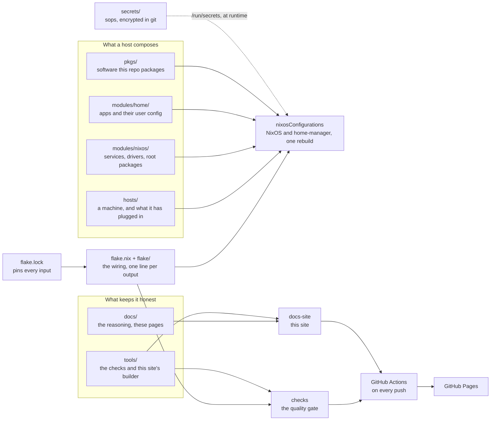

# docs

The reasoning behind every module of this machine, the procedures Nix cannot reach, and the
record of what was tried and rejected.

## Start here

| If you want to | Go to |
| --- | --- |
| understand how the repo is put together | [rules.md](rules.md), then [notes/repo/flake.md](notes/repo/flake.md) |
| rebuild or recover the machine | [guides/disaster-recovery.md](guides/disaster-recovery.md) |
| read about one subsystem | [notes/](notes/), grouped by subject |
| know what is open right now | [open-items.md](open-items.md) |

Nothing on this page repeats a fact from the [repository README](../README.md): host, base,
desktop and storage have one owner and it is that file.

## The repo in one picture

Every box is a folder at the root of the repo, and [rule 4](rules.md#4-modules-offer-hosts-compose)
says what goes in which:

## How this folder is organized

It used to be a single file (`ANOTACOES.md`, 1949 lines). It became six, because a god
file hides things: with 98 closed entries mixed in with 15 open ones, finding what to do
today meant scrolling through six months of history.

The split is by **function**, not by topic. What you read every day (the rules), what you
act on (the open items) and what you look up (the history) have different rhythms.

| File | What it is | When you read it |
| --- | --- | --- |
| [rules.md](rules.md) | The rules that govern this repo | Before deciding anything |
| [decisions/](decisions/README.md) | The choices made on a date, with what was compared, and their status | "Why this tool and not that one?" |
| [open-items.md](open-items.md) | What is still open | When picking what to work on |
| [history/](history/) | What was done and why, a folder per year and a file per month | "What happened that day?" |
| [notes/](notes/) | One page per module: why it is the way it is, and the traps | "Why is THIS module like this?" |
| [ideas.md](ideas.md) | Considered, not decided yet | When planning |
| [arch-linux.md](arch-linux.md) | A closed chapter + how to open the archive | Rarely |
| [arch-parity-audit.md](arch-parity-audit.md) | `main` against `nixos`, area by area: what was ported, replaced, dropped and still missing | Before retiring the Arch refs |
| [guides/](guides/) | Step by step for what Nix cannot reach (BIOS, Secure Boot, router, Windows), plus the reusable TEST protocols | When reinstalling, working outside the repo, or validating a change |

**This tree is also a site.** <https://dotfiles.v1cferr.dev/> renders exactly these files,
with search and a nav grouped by subject. The files did not move to match that nav, and
[notes/repo/site.md](notes/repo/site.md) says why.

## Conventions

**The rule numbering is API**, and how often it is cited is measured in [rules.md](rules.md),
which is the only place that number lives: a new rule goes in at the end, a dead rule gets struck
through instead of disappearing, and `rules-index` fails on a citation that points at neither.

**A good entry explains the WHY and the trap**, not the what, because the code already says
the what. The most valuable entries here are the ones recording something TRIED AND
REJECTED, because they keep the next person (or you in six months) from repeating it.

**A finished item migrates** from `open-items.md` to `history/<month>.md`. One file only
grows, the other one shrinks.

**History is append-only, notes are kept current.** The diary keeps a stale entry, because a
diary that gets edited stops being evidence. A `notes/` page that stops being true is a bug
(rule 16).
