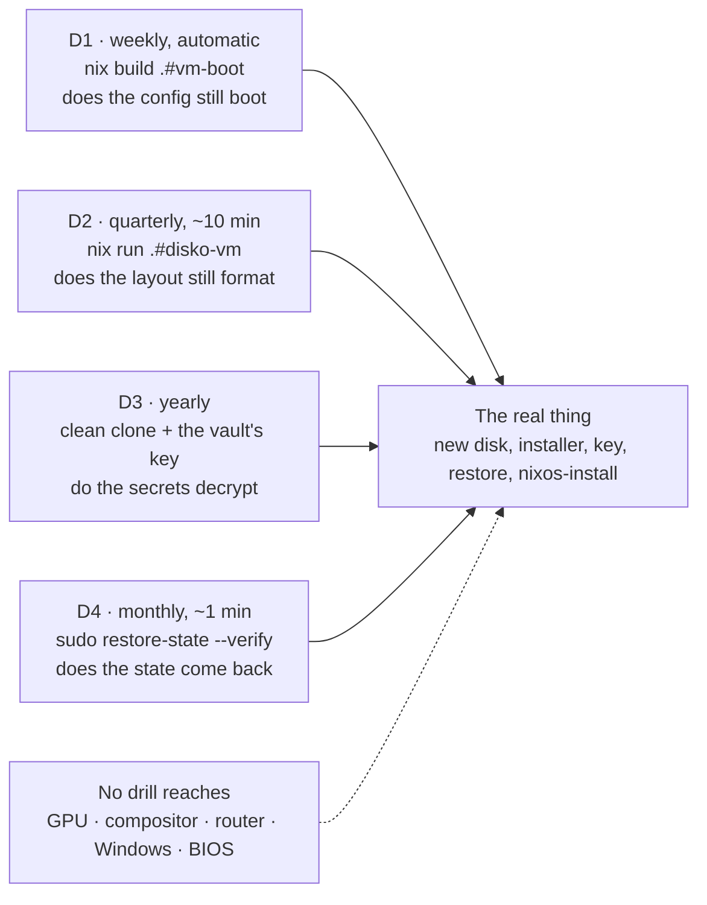

# Disaster recovery: the protocol that proves this repo rebuilds the machine

This repo claims to be the SSOT of my infrastructure. A claim with no rehearsal is a belief, and the
day it stops being true is the day I need it. So there are four drills, cheapest first, and each one
says exactly what it does NOT prove.



## The one thing that is not in git

The age key. Everything else, including every secret, is either in the tree or reproducible from it;
`secrets/secrets.yaml` is encrypted FOR that key. Two recipients exist on purpose
([`../notes/repo/secrets.md`](../notes/repo/secrets.md)): the host key at
`/var/lib/sops-nix/key.txt` and an offline backup. Lose both and every secret is gone, permanently.

And the cascade is bigger than "no passwords", which the disko VM measured on 23/08/2026: with no
key, `sops-install-secrets` fails in the initrd, so the user's `hashedPasswordFile` never appears,
and on a fresh install that used to take home-manager down with it (see
[`../notes/boot-and-storage/disko.md`](../notes/boot-and-storage/disko.md)). A restore without the
key does not degrade gracefully.

## Why the key does NOT get copied into this repo

The tempting shortcut is to pull it from Bitwarden once into a `.env` next to the flake and be done.
Refused, and not on principle: three concrete reasons and one precedent.

1. **This repo is PUBLIC.** A key in the working tree is one `git add -f`, one `git stash`, or one
   careless glob away from being published forever. `.gitignore` protects against a typo, not
   against a mistake, and there is no rotating your way out of a published master key: it decrypts
   every value ever committed to `secrets.yaml`, including in the history.
2. **It would sit in reach of everything running as this user**: an editor extension, an `npm
   postinstall`, an AI agent with file access, a misconfigured sync client. The key is root-owned
   `0600` at `/var/lib/sops-nix/key.txt` for exactly that reason, and copying it into `$HOME` throws
   that away.
3. **The repo folder is inside `$HOME`**, so it is in reach of the backups and of every future
   clone. A secret whose whole design is "outside git" would come back in through restic.

THE PRECEDENT, and it is this repo's own: `modules/nixos/core/sync-secrets.sh` already needs the key and reads
it as `SOPS_AGE_KEY="$(sudo cat /var/lib/sops-nix/key.txt)"`, with the comment "read ONLY into the
process' memory, it does not go to disk". The drills below follow the same rule: the key passes
through the ENVIRONMENT or through a tmpfs that dies with the boot, never through the repo.

## D1, weekly and automatic: does the config still boot

Nothing to do. `modules/home/services/vm-boot-drill.nix` runs `nix build .#vm-boot` every Sunday, silent on
success and one ntfy push on failure. It boots the whole config in QEMU and asserts that it was
APPLIED: `multi-user.target`, sshd, the user with their shell, the home-manager generation with
`Result=success`, and no failed unit ([`../notes/repo/vm-boot.md`](../notes/repo/vm-boot.md)).

It does NOT touch the disk layout, the secrets, the GPU or the bootloader.

## D2, quarterly, about 10 minutes: does the LAYOUT still format

```sh
nix run .#disko-vm     # Ctrl-A then X to leave the VM
```

It builds a 24 GiB image, runs the REAL disko script against it, boots the config on the result and
prints a report. Read four things in it:

- **the 7 subvolumes**: `@ @home @log @nix @persist @snapshots @swap`
- **the mount options**, and remember that only the first mount decides for the filesystem: `/` must
  show `noatime,compress=zstd:1,discard=async`
- **the swap line**: `/swap/swapfile file` present means `mkswapfile` did its job
- **zero failed units**, and nothing hidden under `@/home` (that section is a regression guard for
  the first-boot bug this VM found)

It does NOT prove the bootloader: the VM boots the kernel directly, so GRUB, its Secure Boot
signature and `os-prober` are outside it. That half lives in
[`boot.md`](../notes/boot-and-storage/boot.md) and in the BIOS.

## D3, yearly or before touching hardware: the secrets half

The only drill that needs the key, and the one that proves the claim "the public repo plus the vault
is enough".

```sh
# 1. a scratch directory on TMPFS: it dies with this boot, and it is not in the repo
d=$(mktemp -d -p "$XDG_RUNTIME_DIR") && chmod 700 "$d"

# 2. a CLEAN clone, over https and with no local state, exactly what a stranger machine gets
git clone https://github.com/v1cferr/dotfiles "$d/dotfiles"

# 3. the key from the vault, into the ENVIRONMENT and not into a file. The item's name and shape
#    (a note, a custom field, an attachment) is whatever the vault says, so find it first:
export BW_SESSION=$(bw unlock --raw)
bw list items --search age | jq -r '.[] | .name'
export SOPS_AGE_KEY="$(bw get notes '<the item the line above named>')"

# 4. THE ACTUAL TEST: does that key decrypt the repo's secrets?
cd "$d/dotfiles" && nix shell nixpkgs#sops -c sops -d secrets/secrets.yaml | head -3

# 5. clean up. The tmpfs would go on reboot anyway; do not wait for it.
unset SOPS_AGE_KEY BW_SESSION && rm -rf "$d"
```

If step 4 prints plaintext, the disaster-recovery claim holds: a stranger machine plus the vault
reproduces every secret. If it fails, fix THAT before anything else, because no other drill can
substitute for it.

Do the same with the OFFLINE backup key at least once a year, since a backup nobody has ever read is
a backup nobody knows is empty.

## D4, monthly, about a minute: does the STATE come back

```sh
sudo restore-state --verify
```

It restores the identity set (Secure Boot keys, SSH host keys, NM profiles, Bluetooth pairings,
`/var/lib/nixos`) from the newest snapshot on the USB disk into a temporary directory, diffs each
path against the live machine and deletes the copy. Silence plus "matches" is a pass; a `diff`
line is either a real change since the last snapshot (an NM profile edited today) or a broken
backup, and only the first is fine.

It does NOT restore `~`, the photos or the databases: those are too big to rehearse monthly, and
their proof is the backup's own 2% pack check plus the one-time restore of each dump recorded in
[restic](../notes/boot-and-storage/restic.md). It needs the backup turned on
([decision 0011](../decisions/0011-local-usb-backup.md)).

## The real thing: the disk died and a new one is in

In order, and step 4 is the one that is easy to forget and expensive to skip.

### 1. Boot the installer and clone the repo

Boot the installer USB stick, `git clone https://github.com/v1cferr/dotfiles`.

### 2. Point disko at the new disk

**ONE line changes**: `device` in `hosts/ex-b560m-v5/disko.nix` carries the drive's SERIAL, so the
new disk needs its own `by-id` path. Nothing else in the repo knows the disk.

### 3. Format and mount

```sh
sudo nix run github:nix-community/disko -- --mode destroy,format,mount --flake .#ex-b560m-v5
```

### 4. Put the key in place BEFORE the first boot

Skip it and the cascade at the top of this page happens on a machine you are trying to rescue:

```sh
sudo install -D -m 0600 /dev/stdin /mnt/var/lib/sops-nix/key.txt   # paste the key, then Ctrl-D
```

### 5. Restore the state BEFORE the install

Plug in the USB disk labelled `BACKUP`, then:

```sh
sudo nix run .#restore-state      # into /mnt; the age key from step 4 decrypts the repo password
```

It puts back `~`, `/srv/photos`, the database dumps and the identity set. Doing it BEFORE
`nixos-install` is the point: the system's first boot already finds its SSH host keys, its Wi-Fi,
its uid map and its Secure Boot keys, instead of minting new ones.

Wine prefixes, Downloads and `/srv/media` are not in the backup on purpose
([restic](../notes/boot-and-storage/restic.md)).

### 6. Install and reboot

`sudo nixos-install --flake .#ex-b560m-v5`, then reboot.

### 7. Bring the databases back

With the stacks up, `sudo restore-dbs` loads each Postgres dump into its container (it asks first:
`pg_restore --clean` replaces what the fresh container made). Immich restores itself: its welcome
screen offers "Restore from backup", reading the dumps that came back inside `/srv/photos`.

### 8. Enroll Secure Boot

The keys came back in step 5, so this is `sudo sbctl enroll-keys -m` against the new
firmware, with no new keys to create ([`boot.md`](../notes/boot-and-storage/boot.md)).

## What no drill here covers

The GPU and the compositor (a VM has neither), the router (its own mirror and its own guide), the
Windows side of the dualboot, and every step that happens in the BIOS. Those are not gaps to close
by writing more Nix: they are the honest edge of what a declarative config can promise.
